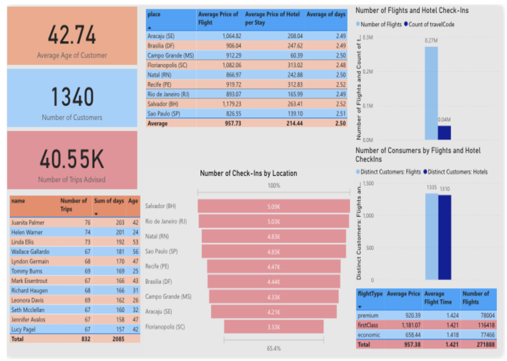

# Passport Paradise: Data-Driven Travel Solutions

**Executive Summary**  
**Passport Paradise** is a full-service travel agency focused on providing personalized travel experiences, ranging from luxury getaways to budget-friendly trips. We specialize in vacation planning, corporate travel, group bookings, and tailored itineraries. Our commitment is to create journeys that reflect our clients' unique preferences, delivering seamless and memorable experiences.

- **Mission**: To inspire and facilitate extraordinary travel experiences through professional, personalized services.
- **Vision**: To be recognized for unparalleled customer service, extensive destination knowledge, and the ability to turn travel dreams into reality.

**Services Offered**  
- **Leisure Travel**: Customized vacation packages, honeymoons, family holidays.
- **Corporate Travel**: Tailored solutions for business trips, meetings, and incentive travel.
- **Group Travel**: Group bookings for events, tours, and destination weddings.
- **Luxury Travel**: Exclusive experiences including private jets, yachts, and five-star accommodations.
- **Travel Consultancy**: Expert advice on travel trends, destination tips, and personalized itineraries.

**Project Overview**  
This project uses big data analytics to enhance the customer travel experience and optimize Passport Paradise's business strategies. Our goal is to leverage data-driven insights to provide better travel recommendations, predictive analytics for future travel trends, and tailored marketing strategies.

**Key Objectives**  
1. Identify meaningful trends in travel experiences, reviews, and preferences.
2. Optimize marketing strategies based on customer data insights.
3. Utilize predictive analytics to forecast travel trends and enhance customer satisfaction.

**Tools and Technologies**  
- **Data Sources**: [Kaggle datasets](https://www.kaggle.com/datasets/leomauro/argodatathon2019), including the Argo Datathon 2019 dataset (corporate travel data).
- **Data Processing**: Azure Data Factory, Azure Databricks, Microsoft Fabric.
- **Data Visualization**: Power BI for creating interactive dashboards and visualizations.
- **SQL**: Used for data integration and storage.
- **Data Preparation**: Microsoft Excel, Power Query for cleaning and transforming data.

**Project Highlights**  
- **Data-Driven Insights**: Analyze customer preferences to optimize marketing strategies and travel offerings.
- **Predictive Analytics**: Forecast travel trends to stay ahead of the market.
- **Personalized Marketing**: Use customer segmentation to create personalized campaigns and improve customer retention.

**Data & Analysis**  
The project uses descriptive, diagnostic, predictive, and prescriptive analytics on a dataset containing travel bookings, flight details, hotel stays, and user profiles. We analyze travel patterns and behavior to make business recommendations and improve customer satisfaction.

**Ongoing Final Project**  
This project is currently in progress, with data processing, analysis, and visualization ongoing. Future work includes enhancing predictive models and refining our marketing strategies based on customer preferences and travel trends.
